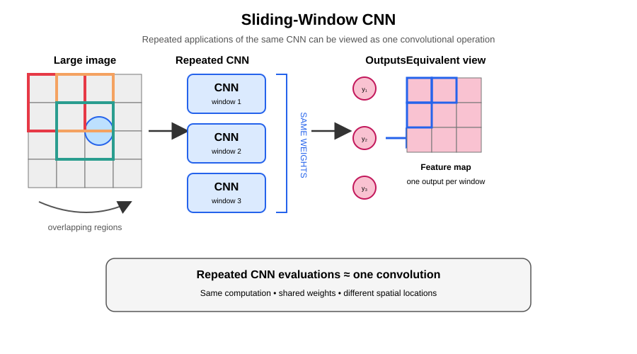

## Object Detection
CNNS are noot limited to just classification tasks. They learn internal representations that have broad applicability.

Typical definition of a bounding box to describe the location of an object is by using four coordinates $(b_{x}, b_{y}, b_{W}, b_{H})$ where $(b_{x}, b_{y})$ is the center of the rectangle, and $W, H$ are its width and height. We can either directly use pixels or use a reference coordinate system where left top of the image is $(0,0)$ and bottom right is $(1,1)$.

### Intersection Over Union
This is often used as an evaluation metric. It helps us understand whether the bounding box is centered correctly.

$$
\begin{aligned}
\text{IoU} = \frac{\text{area of intersection}}{\text{area of union}}
\end{aligned}
$$

this is usually calculated between the predicted bounding box and a ground truth bounding box. It ranges from 0 to 1, and values less than 0.5 are typically discarded.

### Scaling
Distort the input image and bounding both horizontally and vertically. We get a new image with a new bounding box for the ground truth. This is useful for data augmentation.

### Sliding Window
We run our CNN network over different windows in the image. The windows essentially move one ore few pixles at a time.

But note that we are doing a lot of repeated calculations here because of the overlaps. Consider one pass of CNN, it produces say one end node that further connects into a CNN. Now move the window and we get another end node connected to the FCN. If we move both horizontally and vertically in the same fashion, we get an _image_ of end nodes.

Thus, the sliding window can itself be modelled like a CNN operation, with shared weights and we can build optimizations off of this approach.

To understand, note the following
- Convolutional layers have no restriction on input sizes
    - A $3 \times 3$ convolution on an input of $4 \times 4$ will produce an output of size $2 \times 2$
    - The same convolution, on an input of $5 \times 5$ will work and produce an output of size $3 \times 3$
- Fully connected layers typically expect a fixed sized input since the weight matrices have to respect dimensionality

We leave the convoluational layers untouched; they work on a larger input just fine. They will just give a larger feature map as output now instead.

We modify the Fully connected part of the network. For discussion, suppose the input to the network was a feature map of $7 \times 7 \times 512$, and when flattened and passed through the FC layer, say it would produce 4096 neurons (number of)
- Note that convolutional operation is very similar to a FC operation mathematically. We multiply inputs by weights, add bias and produce the output.
- We can rearrange the weights so that they act on the input feature map and produce 4096 outputs.
- The easiest way to achieve this is to use a convolution of the same size as the input feature map (so that the output is of $1 \times 1$ dimension, a flattened version)
- The $C_{in}$ of this filter will be 512, and $C_{out}$ of this filter will be 4096 because by ensuring filters of size $ \times 7$ we have ensured that the output is of size 1.. to make it an output of size 4096, we need those many channels
- Hence, we can replace the FC with an equivalent Convolutional operation of dimensions $7 \times 7 \times 512 \times 4096$
- We can continue the same process over multiple fully connected layers, converting each to a convolutional operation using filters of appropriate dimensions
- Now the final output is an image of class distributions, each _pixel_ of that output representing what a run of the CNN over the corresponding input patch of the image would have produced

### Non-max suppression
The sliding window approach will give multiple bouding boxes with different confidence scores (class probability). How do we narrow down to the limited set of boxes to output ?

- First, eliminate all boxes with predictions below a certain threshold, say 0.7
- Next, start with the box with highest probability and mark it as a detection
- Next, discard all the boxes with IoU above a certain threshold, say 0.5 (we are removing boxes with high overlap since they most likely represent variants of the same bounding box)
- Again, among the boxes not marked as a detection or not discarded, choose the one with the highest probability; mark it as a detection and continue the above process
- The process terminates till all boxes have not been marked as a detection or discarded

### Fast Region CNNs
Sliding window approach is optimized because it uses similarities to convolutional operations to speed things up. However, computation is wasted over regions that do not contain an object.

We can instead use a cheap segmentation algorithm to find regions of highest probabilities to contain an object, and only run the CNN over those regions. This is called **Fast R-CNN**.

It is also possible to use a CNN for region proposal, and is called **Faster R-CNN**.
