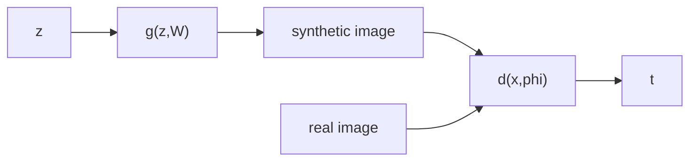
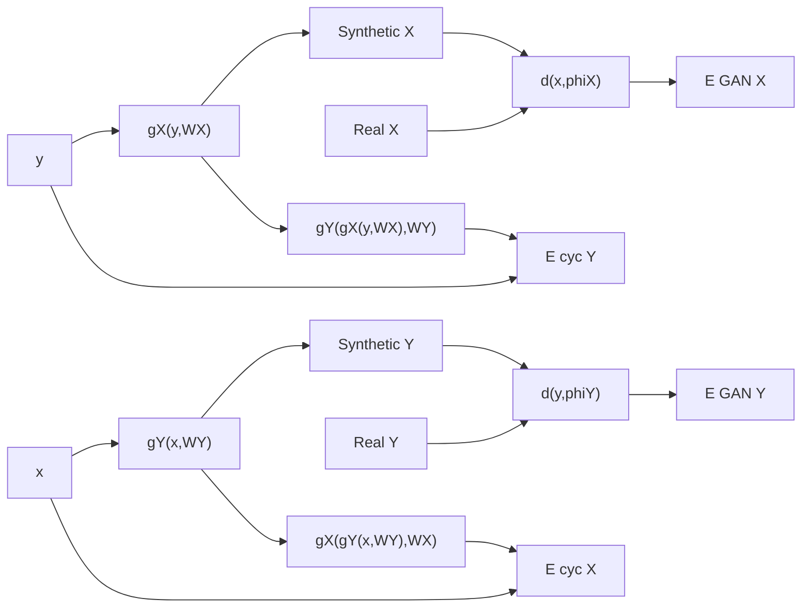

# Generative Adversarial Networks
The basic task of generative models is to learn a distribution from the training data, and then generate a new example from that distribution. We model $p(x|W)$ where $x$ is a vector in the data space, and $W$ is a set of learnable parameters/weights.

If we want to condition on this using a set of vectors, we use a vector $c$ and the equation becomes $p(x|c, W)$. For example, just $p(x|W)$ might mean generate a face, while $p(x|c,W)$ might mean generate a face with sunglasses.

Deep learning helps us learn these complex real world distributions.

Suppose the task is to go from a latent vector $z$ to a data vector $x$. Let $p(z)$ denote the distribution in latent space. Then our generator can be modeled as $x = g(z, W)$.

Solving for this directly is dificult as both $z$ and $w$ are unknown. The key idea of a GAN (Generative Adversarial Network) is that we can use a discrimantor network jointly trained with a generator to provide the necessary training signal for updating the weights of a generator.

The process can be represented in a flowchart as below

Note that both the real and synthetic images are not directly fed to the discrimantor, but instead, both are used for the training of the discrimantor.

The generator maximizes the error of the discrimantor by providing images as close to the real ones, while the discriminator minimizes the error by better discriminating between the real images and the output of generator.

The term adversarial is used here because the two networks are working against each other. Its a zero sum game because the gains by one network as offset by another.

Lets define $t$ above as the binary classification label. $t=1$ refers to a real image and $t=0$ refers to a synthetic one. Then, $P(t=1) = d(x, \phi)$ where $\phi$ are the training weights of the discriminator.

The loss function can be written as below

$$
\begin{aligned}
E_{GAN}(w, \phi) = &-\frac{1}{N_{real}}\sum_{n \in \text{real}} \ln d(x_{n}, \phi)\newline &-\frac{1}{N_{synth}}\sum_{n \in \text{synth}} \ln (1 - d(g(z_{n}, w), \phi))
\end{aligned}
$$

which is nothing but a simple cross entropy loss. $z_{n}$ is randomly sampled from the latent space. The output of the generator is treated as a synthetic example, and real images are also used for training.

## Adversarial Training
In this, $E_{GAN}$ is
- minimized with respect to $\phi$ (gradient descent)
- maximized with respect to $w$ (gradient ascent)

$$
\begin{aligned}
\delta \phi &= -\lambda \nabla_{\phi}E_{n}(w, \phi)\newline
\delta w &= \lambda \nabla_{w}E_{n}(w, \phi)\newline
\end{aligned}
$$

We usually use a mini-batch of examples instead of a single example during training. While training, we alternately update the weights $w$ and $\phi$ (which means while updating one, the other is constant).

GANs learn continuous representations. For example, consider a facial image generation GAN. Now, when we sample a point, and start in a direction, it could mean that the glass color changes continuously as we move in that direction. Another direction can be related to face orientation for instance. Similar to vector embeddings of words, latent space also follows similar semantic behaviours.

## Conditional GANs
Conditional GANs condition on a vector $c_{n}$ for both the generator and discriminator and have an added advantage that compared to separate training for each of the individual values of conditiona vector $c_{n}$, bettern joint distributions are learnt and the training data is efficiently utilized.

## Problems in training GANs
We saw earlier that the GAN loss consists of both maximizing and minimizing it, in order to optimize different weights. This means that the loss keeps oscillating and there is no clear direction of progress per se.

**Mode Collapse** can also happen. Suppose the generator weights adapt during training such that all the latent variables sampled from $Z$ are all mapped to a subset of the possible valid outputs. Example, generator only producing hand written digit 3 when being trained with a handwritten digit dataset. The discriminator will not be able to guage the fact that the generator is generating examples from a single class.

Because the dicriminator output for generator output is supposed to be equal to zero across the entire region spanned by the generated samples, small changes in $W$ will produce very little changes in the the output. Hence, the gradients are small and training will be slow.

### Strategies for fixes

To fix this, we can make the dicriminator loss smoother by using a real valued output in the range of 0 to 1, instead of binary, and MSE instead of cross entropy loss.

**Instance Noise** is the process of adding a guassian noise to both the real and synthetic samples. This blurs the demarcation between the real and synthetic data, making for a smoother discrimination function.

We can also make changes to the error function itself. Transition the term

$$
\begin{aligned}
-\frac{1}{N_{synth}}\sum_{n \in synth} \ln (1 - d(g(z_{n}, W), \phi))
\end{aligned}
$$

which is trying to minimize the probability that the image is fake, to

$$
\begin{aligned}
\frac{1}{N_{synth}}\sum_{n \in synth} \ln (d(g(z_{n}, W) \phi))
\end{aligned}
$$

which is trying to maximize the probability that the image is real.

The gradients of the two functions near zero are very different and the modified form allows for much faster training.

## CycleGAN
So far, we have seen the application of GAN to go from the latent space to the data space. We can also use the concept to go from a domain $X$ (for example a photograph) to another domain $Y$ (for example a painting).

Consider the transformation of an image from $X$ to $Y$ and vice versa. We consider to generators $g_{X}$, $g_{Y}$ and two dicriminators $d_{X}$, $d_{Y}$. We have two passes over our regular GAN architecture. However, the two GANs are independent and not conditioned anywhere. To do that, we introduce another loss called $E_{cyc}$ or the cycle loss.

The cycle loss works by literally considering a cycle that starts in $X$, transforms to a syntethic $Y$ using $g_{Y}$ and then transforms back into $X$ via $g_{x}$ giving an overall equation

$$
\begin{aligned}
x_{n} \to g_{Y}(x_{n}, W_{Y}) \to y_{n} \to g_{X}(y_{n}, W_{X}) \to x_{n}^{\prime}
\end{aligned}
$$

Now, we try to minimze the error between $x_{n}$ and $x_{n}^{\prime}$ since under perfect transformations, we should be able to recover $x_{n}$ back.

$$
\begin{aligned}
E_{cyc}(W_{X}, W_{Y}) = &\frac{1}{N_{X}}\sum_{n \in X} || g_{X}(g_{Y}(x_{n})) - x_{n} ||_{1}\newline
+ &\frac{1}{N_{Y}}\sum_{n \in Y} || g_{Y}(g_{X}(y_{n})) - y_{n} ||_{1}
\end{aligned}
$$

and the total error becomes

$$
\begin{aligned}
E_{GAN}(W_{X}, \phi_{X}) + E_{GAN}(W_{Y}, \phi_{Y}) + \eta E_{cyc}(W_{X}, W_{Y})
\end{aligned}
$$

where $\eta$ is used to control the relative weightage between the GAN and cycle errors.
