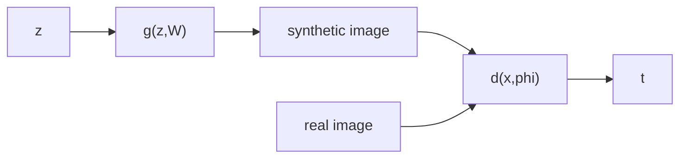

# Generative Adversarial Networks
The basic task of generative models is to learn a distribution from the training data, and then generate a new example from that distribution. We model $p(x|W)$ where $x$ is a vector in the data space, and $W$ is a set of learnable parameters/weights.

If we want to condition on this using a set of vectors, we use a vector $c$ and the equation becomes $p(x|c, W)$. For example, just $p(x|W)$ might mean generate a face, while $p(x|c,W)$ might mean generate a face with sunglasses.

Deep learning helps us learn these complex real world distributions.

Suppose the task is to go from a latent vector $z$ to a data vector $x$. Let $p(z)$ denote the distribution in latent space. Then our generator can be modeled as $x = g(z, W)$.

Solving for this directly is dificult as both $z$ and $w$ are unknown. The key idea of a GAN (Generative Adversarial Network) is that we can use a discrimantor network jointly trained with a generator to provide the necessary training signal for updating the weights of a generator.

The process can be represented in a flowchart as below

Note that both the real and synthetic images are not directly fed to the discrimantor, but instead, both are used for the training of the discrimantor.

The generator maximizes the error of the discrimantor by providing images as close to the real ones, while the discriminator minimizes the error by better discriminating between the real images and the output of generator.

The term adversarial is used here because the two networks are working against each other. Its a zero sum game because the gains by one network as offset by another.

Lets define $t$ above as the binary classification label. $t=1$ refers to a real image and $t=0$ refers to a synthetic one. Then, $P(t=1) = d(x, \phi)$ where $\phi$ are the training weights of the discriminator.

The loss function can be written as below

$$
\begin{aligned}
E_{GAN}(w, \phi) = &-\frac{1}{N_{real}}\sum_{n \in \text{real}} \ln d(x_{n}, \phi)\newline &-\frac{1}{N_{synth}}\sum_{n \in \text{synth}} \ln (1 - d(g(z_{n}, w), \phi))
\end{aligned}
$$

which is nothing but a simple cross entropy loss. $z_{n}$ is randomly sampled from the latent space. The output of the generator is treated as a synthetic example, and real images are also used for training.

## Adversarial Training
In this, $E_{GAN}$ is
- minimized with respect to $\phi$ (gradient descent)
- maximized with respect to $w$ (gradient ascent)

$$
\begin{aligned}
\delta \phi &= -\lambda \nabla_{\phi}E_{n}(w, \phi)\newline
\delta w &= \lambda \nabla_{w}E_{n}(w, \phi)\newline
\end{aligned}
$$

We usually use a mini-batch of examples instead of a single example during training. While training, we alternately update the weights $w$ and $\phi$ (which means while updating one, the other is constant).

## Conditional GANs
Conditional GANs condition on a vector $c_{n}$ for both the generator and discriminator and have an added advantage that compared to separate training for each of the individual values of conditiona vector $c_{n}$, bettern joint distributions are learnt and the training data is efficiently utilized.
