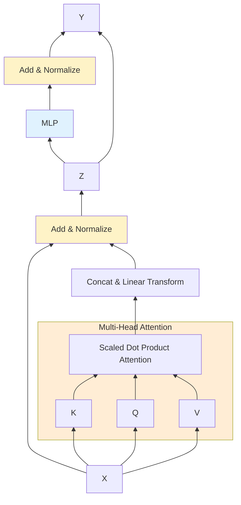

## Attention
To solve for symmetric self attention, we begin introducing assymmetry by forming Keys, Queries and Value vectors using their own matrices that are learnt while training

$$
\begin{aligned}
K &= XW^{k}\\
Q &= XW^{q}\\
V &= XW^{v}\\
Y &= Softmax(QK^{T})V
\end{aligned}
$$

There will be bias parameters too, but we assume they are baked into the matrices themselves, with a single column of 1s added to the input matrix $X$.

### Scaled Attention
Typical formulations look as below

$$
\begin{aligned}
Y = Attention(K, Q, V) = Softmax\left[\frac{QK^{T}}{\sqrt{D}}\right]V
\end{aligned}
$$

The term $\sqrt{D}$ is based on the variance of the dot product of unit vectors with mean $0$ and variance $1$ (independent variables.)

$$
Var(a \cdot b) = \sum_{i=1}^{D} Var(a_{i}b_{i}) = \sum_{i=1}^{D} Var(a_{i}) Var (b_{i}) = \sum_{i=1}^{D} = D
$$

The third part of this equation comes from the independence of the random variables.

Hence, to transform a random variable with Variance $D$ to have a unit variance, we divide it by $\sqrt{D}$.

## Attention Heads
So far we have discussed a single attention heads. However, multiple heads are relevant at the same time. Consider natural language, where one head to relate to vocabulary, another to tense, another to prepositions etc.

We use multiple independent heads, each with its own separate learnable parameters. This is very similar to multiple filters that are used in a single layer of a Convolutional Neural Network (CNN).

Suppose we have $1, ..., H$ heads

$$
\begin{aligned}
H_{h} &= Attention(Q_{h}, K_{h}, V_{h})\\
Q_{h} &= XW_{h}^q\\
K_{h} &= XW_{h}^k\\
V_{h} &= XW_{h}^v \quad \text{where}\quad W_{h}^{v} \in \mathbb{R}^{D \times D_{v}}\\
\end{aligned}
$$

We concatenate these, and linearly trasform to get back the transformed value.

$$
\begin{aligned}
Y = Concat[H_{1}, ..., H_{H}]W^{v}
\end{aligned}
$$

where $W^{v}$ is also learnable.

$D_{v} = D/H$ so that $HD_{v} = D$, which is our output (and input) size.

Note that $HD_{v}$ here represents the size of our concatenated attention blocks.

## Deep Attention Networks
Now, we can stack several of these multi-head attention layers on top of one another to get deep networks. We also add residual connections along with layer normalization to improve the training efficiency.

$$
\begin{aligned}
Z = LayerNorm[Y(X) + X] \quad where \enspace dim(Z) = dim(X)
\end{aligned}
$$

This all is still a linear layer. To add non-linearity, we add a shared fully connected layer (or MLP) across the otutput vectors (i.e., each data point runs through the same neural network).

$$
\begin{aligned}
Y = LayerNorm[MLP(Z) + Z]
\end{aligned}
$$

## Compute
The total compute cost of the network is approximately

$$
\begin{aligned}
Compute &\approx O(N^{2}D) + O(ND^{2})
\end{aligned}
$$

where the first part comes from th edot product in self attention, and the second part comes from the fully connected neural network.

$$
\begin{aligned}
\text{Equivalent (FCN)} &\approx O(N^{2}D^{2})
\end{aligned}
$$

where FCN is the acronym for fully connected network.
