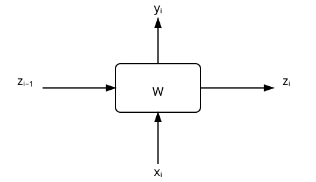

## Sequence Modelling
We are interested in modelling a sequence of words $x_{1}, x_{2}, ...,x_{N}$ and look at a few probabilistic approaches to do so.

But why even worry about this ? We can use sequence modelling to generate a sequence of words. We can use transformers to generate text as well. Since these models are probabilistic, it makes sense to understand how to model these sequences that we are interested in generating.

### Bag of Words Modelling
$$
\begin{aligned}
p(x_{1}, x_{2}, ..., x_{N}) = \prod_{i=1}^{N}p(x_{i})
\end{aligned}
$$

where $p(x_{i})$ refers to the frequency of occurrence of a word in a given dataset.

The biggest problem with this approach is that word ordering is ignored.

### Auto Regressive Model
$$
\begin{aligned}
p(x_{1}, x_{2}, ..., x_{N}) = \prod_{n=1}^{N}p(x_{n} | x_{1}, x_{2}, ..., x_{n-1})
\end{aligned}
$$

The only difference here is that we are using a distribution that is conditional on all the previous words (the right side of the equation).

But note that, this conditional distribution can quickly collapse as the sequences become longer because longer sequences will be infrequent in a text corpus. Further, we would have to sample every possible length of the sequence to be able to do this modeling for any unknown sequence lengths at inference time.

A more efficient methodology here is to use a fixed sequence length.. say 3 as illustrated in the formulation below
$$
\begin{aligned}
p(x_{1}, x_{2}, ..., x_{N}) = p(x_{1})p(x_{1},x_{2})\prod_{n=3}^{N}p(x_{n} | x_{n-2},x_{n-1})
\end{aligned}
$$

In general, these are called n-gram models. This is a markov model as well. Deep neural networks can learn hidden representations that can combine influences from longer sequences without running into problems. These are called hidden markov models.

### RNN (Recurrent Neural Networks) and related models
A typical RNN as the following structure

where the same weight matrix $W$ is shared across the entire sequence.

Now, we can use this concept for generation of text as well.

- First run the entire sequence to generate a final hidden state $Z^{*}$, ignoring the intermediate $y_{i}$ outputs
- Next, use a start token (\<start>) along with the hidden state $Z^{*}$ to generate the first output token $y_{1}$ and a new hidden state $Z_{1}^{*}$
- Using $Z_{1}^{*}$ and previous output token $y_{1}$, generate a new hidden state $Z_{2}^{*}$ and new output token $y_{2}$
- The process is recursively repeated until we generate the stop token (\<stop>)
- Note that at each step, the network does not give the next token $y_{i}$ directly, but rather the probability distribution over the entire dictionary; we use a sampling strategy to pick a single token and continue generation of the sequence
- This is an encoder decoer style of architecture
- The problems with RNN is that they are unable to deal with long range dependencies
    - This primarily happens due to exploding/vanishing gradients problems in very long sequences
- There is also the bottleneck problem: Entire sequence is first compressed into a single hidden state before decoding even begins; this means loss of information from the input sequence and too much focus on the most recent tokens
- The complete sequence needs to be processed sequentially due to the nature of the architecture; there is no parallelization possible over GPUs for a given sequence
- LSTM/GRY add more signal paths and allow capturing more complex dependencies; but that is still not sufficient niether efficient
