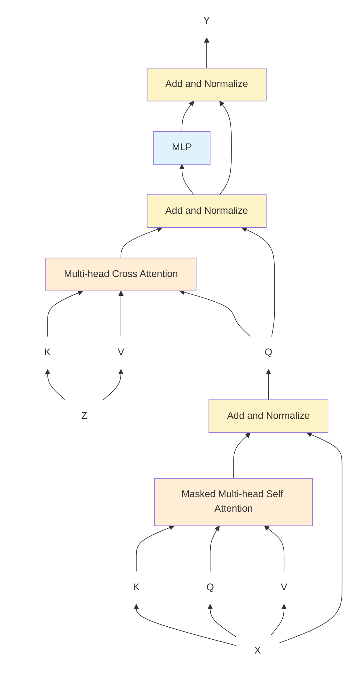

## Sequence to Sequence or Encoder Decoder Models
- We need to condition the output on the entire input sequence
- Use encoder architecture to map input to an internal representation
- **Cross attention**: Keys and Values are used from $Z$ (output of encoder), but $Q$ comes from the output sequence
    - This is based on the intuition that the output asks queries which must be answered using the Keys from the input
    - Very similar to user bringing their queries, and the librarian answering based on available Keys with each book
- Training is done using pairs of input and output sentences

Decoder section of this architecture looks as below

This model was originally used in the Attention paper for a translation style task.
