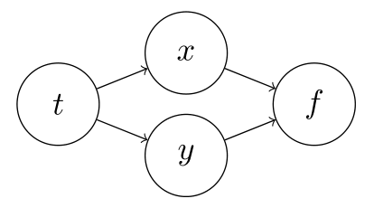
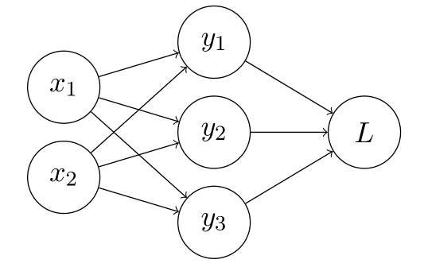

# Backpropagation

To make a neural network learn, we need to backpropagate the errors through the network so that each individual parameter can be adjusted. For every parameter, we will need to calculate $dL/dw$ where $w$ is the value of the parameter and $L$ is the loss. Consider a simple regression network with activation function $\sigma$

$$
\begin{aligned}
    z &= wx + b\newline
    \hat{y} &= \sigma(z)\newline
    L &= \frac{1}{2}(y - \hat{y})^{2}\end{aligned}
$$

We use chain rule to backpropagate the errors

$$
\begin{aligned}
    \frac{dL}{dw} &= \frac{dL}{dz}\frac{dz}{dw} = \frac{dL}{d\hat{y}}\frac{d\hat{y}}{dz}\frac{dz}{dw}\newline
    \frac{dL}{d\hat{y}} &= \hat{y} - y\newline
    \frac{d\hat{y}}{dz} &= \sigma^{\prime}(z)\newline
    \frac{dz}{dw} &= x\end{aligned}
$$

In the multivariate case, we need to sum over all the child variables/dependents. The following example will make it clear

<figure class="notes-img backprop_1">
  
</figure>

$$
\begin{aligned}
     \frac{\partial}{\partial t} f(x(t), y(t)) = \frac{\partial f}{\partial x}\frac{\partial x}{\partial t} + \frac{\partial f}{\partial y}\frac{\partial y}{\partial t}\end{aligned}
$$

i.e., the total gradient will flow through all the common connections. Another example with more interconnected variables

<figure class="notes-img backprop_1">
  
</figure>

$$
\begin{aligned}
    \frac{\partial L}{\partial x_{i}} &= \frac{\partial L}{\partial y_{1}}\frac{\partial y_{1}}{\partial x_{i}} + \frac{\partial L}{\partial y_{2}}\frac{\partial y_{2}}{\partial x_{i}} + \frac{\partial L}{\partial y_{3}}\frac{\partial y_{3}}{\partial x_{i}}\newline
    &= \sum_{j=1}^{3} \frac{\partial L}{\partial y_{j}}\frac{\partial y_{j}}{\partial x_{i}}\end{aligned}
$$

Generalizing for vector $x = (x_{1}, x_{2})$, we can write this using the jacobian matrix

$$
\begin{aligned}
    \frac{\partial L}{\partial x} &= \frac{\partial L}{\partial y} \frac{\partial y}{\partial x}\newline
    \frac{\partial L}{\partial x} &= \begin{bmatrix}
        \partial y_{1}/\partial x_{1} &\partial y_{2}/\partial x_{1} &\partial y_{3}/\partial x_{1}\newline
        \partial y_{1}/\partial x_{2} &\partial y_{2}/\partial x_{2} &\partial y_{3}/\partial x_{2}\newline
    \end{bmatrix} \bigg(\frac{\partial L}{\partial y_{1}}, \frac{\partial L}{\partial y_{2}}, \frac{\partial L}{\partial y_{3}} \bigg)^{T}\newline
    \text{error at } x &= J^{T} \times \text{error at } y
    \end{aligned}
$$

where $J$ is the jacobian, $L$ is scalar (loss), $x$ and $y$ are column vectors.

For element wise transformations like the exponent

$$
\begin{aligned}
    y = exp(x)\end{aligned}
$$

where both $y$ and $x$ are vectors of the same size $n$, we can calculate the gradients as

$$
\begin{aligned}
    \frac{dy}{dx} &= \begin{bmatrix}
        exp(x_{1}) &\cdots &0\newline
        \vdots &\ddots &\vdots\newline
        0 &\cdots &exp(x_{n})\newline
    \end{bmatrix}\newline
    \frac{dL}{dx} &= \frac{dL}{dy}\frac{dy}{dx}
    = \begin{bmatrix}
        exp(x_{1}) &\cdots &0\newline
        \vdots &\ddots &\vdots\newline
        0 &\cdots &exp(x_{n})\newline
    \end{bmatrix} \bigg( \frac{dL}{dy_{1}}, \ldots, \frac{dL}{dy_{n}} \bigg)^{T}\newline
    &= \bigg( \frac{dL}{dy_{1}} \frac{dy_{1}}{dx_{1}}, \ldots, \frac{dL}{dy_{n}}\frac{dy_{n}}{dx_{n}} \bigg)^{T}\newline
    &= \frac{dL}{dy} \odot \bigg( \frac{dy_{1}}{dx_{1}}, \ldots, \frac{dy_{n}}{dx_{n}} \bigg)^{T}
    \end{aligned}
$$

Thus, we do not need to construct the jacobian explicitly. This simplification suffices where $\odot$ is the elementwise product.

Thus, we can write the gradients with respect to loss as a sum-product of gradient of loss at connected nodes and the gradient of the connected node with respect to node under study. This is mathematically represented in the last equation. Jacobian helps us write this equation in a simpliefied manner. However, Consider a transformation of the format

$$
\begin{aligned}
    N \times p \to N \times m\end{aligned}
$$

The Jacobian will be of the shape $N \times p \times N \times m$ which is extremely large in size even for a small network. We use the error notation defined earlier (error at $x = J^{T} \times $ error at $y$) and directly calculate the product, error times Jacobian, instead of the Jacobian explicitly This product is called **Vector Jacobian Product (VJP)**. Ultimately, we will be only calculating $dL/dw$ everywhere instead of the intermediate Jacobians. This simplifies the calculations to a large extent.
