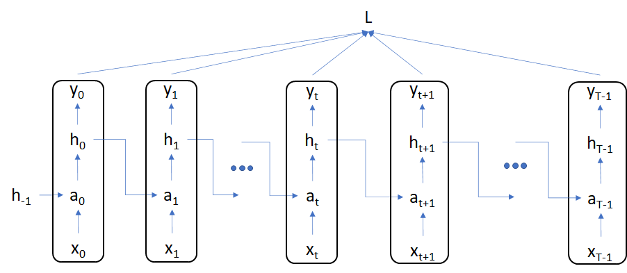
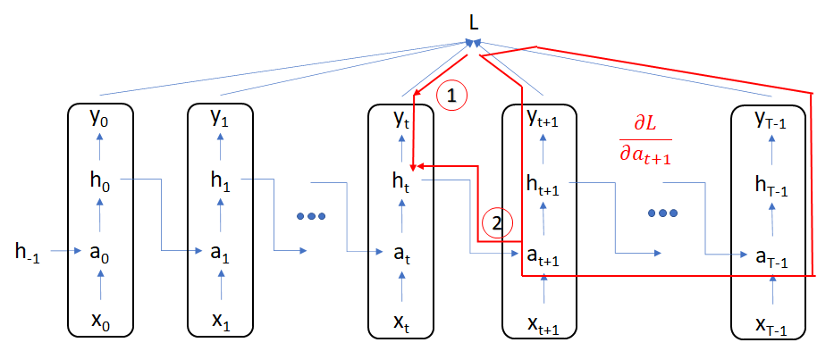

# Backpropagation Through Time (BPTT)

We will illustrate BPTT through a simple RNN with the following structure. The dimensions of the input and hidden states are only for illustration purposes.

For consistency with the code in file [bptt_example_1.py](../../codes/bptt_example_1.md), the time index begins at 0 instead of 1.

<figure class="notes-img">
  
  <figcaption>RNN structure for this section. $L$ is the final scalar loss for calculation of gradients.</figcaption>
</figure>

Our RNN will be govered by the following structure

$$
\begin{aligned}
    a_{t} &= x_{t}W_{xh} + h_{t-1}W_{hh} + b_{h}\newline
    h_{t} &= tanh(a_{t})\newline
    \hat{y}\_{t} &= h_{t}W_{hy} + b_{y}\newline
    l_{t} &= \frac{1}{2N}(\hat{y}\_{t} - y_{t})^{T} (\hat{y}\_{t} - y_{t})\newline
    L &= \frac{1}{T} \sum_{t=0}^{t=T-1} l_{t} \end{aligned}
$$

where $x_{t}$ and $h_{t}$ are matrices representing single or multiple data points.

We first start with the simpler derivatives for $\hat{y}$, $W_{hy}$ and $b_{h}$

$$
\begin{aligned}
{2}
    \frac{\partial{L}}{\partial{\hat{y}\_{t}}} &= \frac{1}{N}(\hat{y}\_{t} - y_{t})\newline
    \frac{\partial{L}}{\partial{W_{hy}}} &= \sum_{t=0}^{T-1} \frac{\partial{L}}{\partial{l_{t}}} \frac{\partial{l_{t}}}{\partial{W_{hy}}}
      &= \sum_{t=0}^{T-1} h_{t}^{T} \frac{\partial{L}}{\partial{l_{t}}}\newline
    \frac{\partial{L}}{\partial{b_{y}}} &= \sum_{t=0}^{T-1} \frac{\partial{L}}{\partial{l_{t}}} \frac{\partial{l_{t}}}{\partial{b_{y}}}
    &= \sum_{t=0}^{T-1} \mathbf{1}\_{N}^{T} \frac{\partial{L}}{\partial{l_{t}}}\end{aligned}
$$

where the latter equations are derived based on the gradient calculations for dense layer in earlier sections.

Gradient calculation for the remaining set of weight matrices becomes easier once we have calculated the gradients for $a_{t}$ and $h_{t}$.

$$
\begin{aligned}
    \frac{\partial{L}}{\partial{h_{t}}} &= \frac{\partial{L}}{\partial{\hat{y}\_{t}}} \frac{\partial{\hat{y}\_{t}}}{\partial{h_{t}}} + \frac{\partial{L}}{\partial{a_{t+1}}} \frac{\partial{a_{t+1}}}{\partial{h_{t}}}\end{aligned}
$$

This equation breaks the gradient flow into two parts

<figure class="notes-img">
  
  <figcaption>Division of gradient flow for calculation of gradients of hidden state at $t$.</figcaption>
</figure>

1.  Gradient flow from $L$ to $h_{t}$ via $a_{t+1}$: this incorporates gradient flow through all of $l_{i}$s for $i > t$

2.  Gradient flow from $L$ to $h_{t}$ directly via $l_{t}$: this component is separate since the gradient to $a_{t+1}$ will not depend on $l_{t}$

Let's also look at the derivative with respect to the activation

$$
\begin{aligned}
    \frac{\partial{L}}{\partial{a_{t}}} &= \frac{\partial{L}}{\partial{h_{t}}} \frac{\partial{h_{t}}}{\partial{a_{t}}}
\end{aligned}
$$

This is valid because the first multiplier incorporates gradient flow through all $l_{i}$s for $i > t$ and there is no other dependency for the gradient flow from $h_{t}$ to $a_{t}$ as they have a direct connection.

To summarize, for gradient calculation of hidden states and activations, we will start the calculation from the highest time index

$$
\begin{alignat}{2}
    \frac{\partial{L}}{\partial{h_{T-1}}} &= \frac{\partial{L}}{\partial{\hat{y}\_{T-1}}} \frac{\partial{\hat{y}\_{T-1}}}{\partial{h_{T-1}}} &&= \frac{\partial{L}}{\partial{\hat{y}\_{T-1}}} W_{hy}^{T}\newline
    \frac{\partial{L}}{\partial{a_{T-1}}} &= \frac{\partial{L}}{\partial{h_{T-1}}} \frac{\partial{h_{T-1}}}{\partial{a_{T-1}}} &&= \frac{\partial{L}}{\partial{h_{T-1}}} \odot (1 - h_{T-1}^{2})\newline
    \frac{\partial{L}}{\partial{h_{T-2}}} &= \frac{\partial{L}}{\partial{\hat{y}\_{T-2}}} \frac{\partial{\hat{y}\_{T-2}}}{\partial{h_{T-2}}} + \frac{\partial{L}}{\partial{a_{T-1}}}\frac{\partial{a_{T-1}}}{\partial{h_{T-1}}}
     &&= \frac{\partial{L}}{\partial{\hat{y}\_{T-2}}} W_{hy}^{T} + \frac{\partial{L}}{\partial{a_{T-1}}} W_{hh}^{T}\newline
    \frac{\partial{L}}{\partial{a_{T-2}}} &= \frac{\partial{L}}{\partial{h_{T-2}}} \frac{\partial{h_{T-2}}}{\partial{a_{T-2}}} &&= \frac{\partial{L}}{\partial{h_{T-2}}} \odot (1 - h_{T-2}^{2})
\end{alignat}
$$

and so on.

we now consider the gradient calculation for $W_{xh}$, $W_{hh}$ and $b_{h}$. Once we know the gradient at any $a_{t}$, the gradient from here to the matrices can be calculated using the formulae from the dense layer

$$
\begin{alignat}{2}
    \frac{\partial{L}}{\partial{W_{xh}}} &= \sum_{t=0}^{T-1} \frac{\partial{L}}{\partial{a_{t}}} \frac{\partial{a_{t}}}{\partial{W_{xh}}} &=  \sum_{t=0}^{T-1} x_{t}^{T} \frac{\partial{L}}{\partial{a_{t}}}\newline
    \frac{\partial{L}}{\partial{W_{hh}}} &= \sum_{t=0}^{T-1} \frac{\partial{L}}{\partial{a_{t}}} \frac{\partial{a_{t}}}{\partial{W_{hh}}} &=  \sum_{t=0}^{T-1} h_{t}^{T} \frac{\partial{L}}{\partial{a_{t}}}\newline
    \frac{\partial{L}}{\partial{b_{h}}} &= \sum_{t=0}^{T-1} \frac{\partial{L}}{\partial{a_{t}}} \frac{\partial{a_{t}}}{\partial{b_{h}}} &=  \sum_{t=0}^{T-1} \mathbf{1}\_{N}^{T} \frac{\partial{L}}{\partial{a_{t}}}
\end{alignat}
$$
