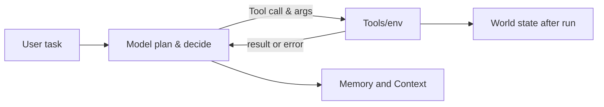

# Agent Evaluation

Ordinary Software has unit tests where for a given single input, we have a single output. LLMs break this concept in four ways

- **Non determinism**: Same prompt can produce different outputs at times. We need many runs and statistics to be confident about the response.
- **No single right answer**: _summarize_ can have multiple acceptable answers, equality checks can fail. We need rubrics and judges.
- **Invisible Regressions**: a prompt change or a tool added for a use case can silently break five others.
- **Compounding steps**: A 10-step agent with 95% success on each step will complete the overall job with only $0.95^{10}$ = 60% success.

Agent evaluations measure whether an agent achieves the outcome the user wanted through an acceptable trajectory, at an acceptable cost, reliably across repeated runs and verified inputs.

## Places an agent can fail

| Part | Typical Failures | How to Catch |
| --- | --- | --- |
| Model reasoning and planning | Wrong plan, gives up early, loops, stops before finishing, hallucinates a fact | Outcome check, step count, judge or final answer |
| Tool selection | Picks wrong tool, calls a tool when none is needed, never calls the needed one | Trajectory graders, single step tests of tool choice |
| Tool arguments | Invented IDs, wrong units, malformed JSON, missing required fields | Schema validation, argument match against a reference |
| Tools and environment | Timeouts, errors, rate limits, stale data; Agent handles these badly, can retry forever or ignores the error | Fault injection, checking reaction to an error result |
| Memory and Context | Forgets and earlier constraint, context overflows, retrieves teh wrong memory | Multi-turn tasks with late references, long context cases |
| Response | Right work but wrong summary, wrong format, unsafe or wrong brand tone, claims success after failing | Format checks, judge for faithfulness to trajectory |
| Whole system | Too slow, too expensive, inconsistent between runs, unsafe side effects | Latency and cost, metrics, pass^k, state diffs |

Agent can output "_task completed_" without making the required state changes (say in a database). It is imperative to grade the state and not just the text.

## What to evaluate

Three levels of granularity. A good system checks all, but we need to be cognizant about what all to evaluate and how much of each.

| What to Evaluate | Meaning | Description |
| --- | --- | --- |
| End to End | Final response and outcome | Black box: given the task, check the answer and the end state. This is robust to new paths, but tells little about why an error occurred. |
| Trajectory | Did the agent take the sensible path? | Check the sequence of tool calls, and the arguments against a reference. This is good for debugging and safety, brittle if only one path is expected. |
| Single Step | Given this state, what is teh right next move? | Freeze the conversation at a decision point, and test only the next action. This is fast, cheap and precise, like a unit test for one decision. |
