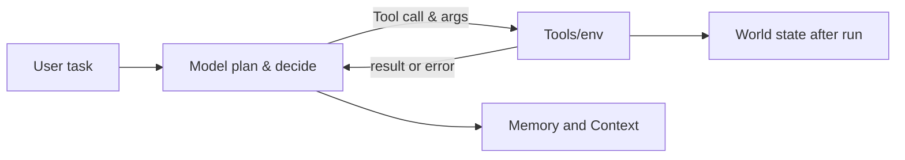
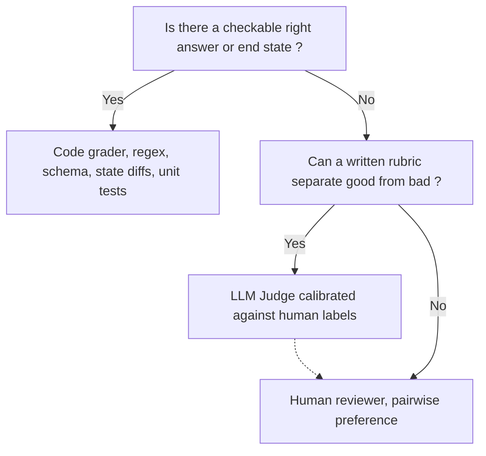

# Agent Evaluation

Ordinary Software has unit tests where for a given single input, we have a single output. LLMs break this concept in four ways

- **Non determinism**: Same prompt can produce different outputs at times. We need many runs and statistics to be confident about the response.
- **No single right answer**: _summarize_ can have multiple acceptable answers, equality checks can fail. We need rubrics and judges.
- **Invisible Regressions**: a prompt change or a tool added for a use case can silently break five others.
- **Compounding steps**: A 10-step agent with 95% success on each step will complete the overall job with only $0.95^{10}$ = 60% success.

Agent evaluations measure whether an agent achieves the outcome the user wanted through an acceptable trajectory, at an acceptable cost, reliably across repeated runs and verified inputs.

## Places an agent can fail

| Part | Typical Failures | How to Catch |
| --- | --- | --- |
| Model reasoning and planning | Wrong plan, gives up early, loops, stops before finishing, hallucinates a fact | Outcome check, step count, judge or final answer |
| Tool selection | Picks wrong tool, calls a tool when none is needed, never calls the needed one | Trajectory graders, single step tests of tool choice |
| Tool arguments | Invented IDs, wrong units, malformed JSON, missing required fields | Schema validation, argument match against a reference |
| Tools and environment | Timeouts, errors, rate limits, stale data; Agent handles these badly, can retry forever or ignores the error | Fault injection, checking reaction to an error result |
| Memory and Context | Forgets and earlier constraint, context overflows, retrieves teh wrong memory | Multi-turn tasks with late references, long context cases |
| Response | Right work but wrong summary, wrong format, unsafe or wrong brand tone, claims success after failing | Format checks, judge for faithfulness to trajectory |
| Whole system | Too slow, too expensive, inconsistent between runs, unsafe side effects | Latency and cost, metrics, pass^k, state diffs |

Agent can output "_task completed_" without making the required state changes (say in a database). It is imperative to grade the state and not just the text.

## What to evaluate

Three levels of granularity. A good system checks all, but we need to be cognizant about what all to evaluate and how much of each.

| What to Evaluate | Meaning | Description |
| --- | --- | --- |
| End to End | Final response and outcome | Black box: given the task, check the answer and the end state. This is robust to new paths, but tells little about why an error occurred. |
| Trajectory | Did the agent take the sensible path? | Check the sequence of tool calls, and the arguments against a reference. This is good for debugging and safety, brittle if only one path is expected. |
| Single Step | Given this state, what is teh right next move? | Freeze the conversation at a decision point, and test only the next action. This is fast, cheap and precise, like a unit test for one decision. |

## Full checklist of dimensions

| Dimension | Question | Type of Grader/Check |
| --- | --- | --- |
| Task success | Was the users' goal achieved ? | State check, exact or fuzzy match, LLM judge |
| Correctness/Factuality | Are the claims true ? | Reference match, judge with reference |
| Groundedness | Is every claim supported by tool results or retrieved context ? | Judge given the context; citation checks |
| Tool Selection | Right tools and no unneeded ones | Set comparison with the expected tools |
| Tool Arguments | Valid, real IDs, right values | JSON schema, argument match, Database lookup |
| Efficiency | Steps, tool calls, tokens, latency, cost | Counters from the trace with budgets |
| Instruction following | Format, length language, policy constraints | Regex, schema checks, LLM Judge |
| Error recovery | Does it handle tool failures sensibly ? | Fault injection and outcome check |
| Safety | No harmful or unauthorized actions, resists prompt injections | Forbidden action checks, red team suites |
| Robustness | Stable under paraphrase, types and noisy input | Perturbed variants of the same task |
| Consistency | Same results across repeated turns | pass^k over k trials |
Calibration | Does stated confidence match accuracy ? Does it defer when unsure ? | Brier Score, ECE, abstention rate |
| Conversation quality | Asks clarifying questions when needed, tone, turns to resolution | Simulated user with a judge |
| User outcomes (online) | Resolution rate, escalations, thumbs up/down, edits, retention | Product analytics joined to traces |

## Three grader types

People and model are most reliable at comparing than at absolute scoring.

Binary pass/fail beats a scoring rubric of style 1-10 almost every time. It is easy to agree on, calibrate, and easier to act on.

## LLM as a Judge

Known judge biases

| Bias Type | Description | Techniques to prevent |
| --- | --- | --- |
| Position Bias | In pairwise mode, it prefers whichever answer comes first | Run both orders and count a win only if it holds in both cases |
| Verbosity Bias | Longer answers score higher | Rubric must include length is not a merit; control for length |
| Self Preference | A model rates text in its own style higher | Use a different model family or at least validate using one |
| Leniency | Passes almost everything | Binary criteria, examples of failures in the prompt, measure its false pass rate |
| Surface Matching | Same words as the source are judged as faithful even when the meaning is reversed | Include such cases in judges' own test set |
| Rubric Drift | Changing the judge prompt or model slightly changes scores | Version the judge, re-validate on every change |

### Rules for a reliable judge

- One narrow criteria per judge. Split "is good" into grounded, complete, correct format, safe.
- Binary verdict with the reasoning before the verdict. Use structured output so it parses.
- Give the judge what it needs to judge, such as reference answer, retrieved context, or tool results.
- Put a few labelled examples of passes and fails in the prompt.
- Judge the judge; Label 50 to 200 examples by hand, and run the judge on them and measure agreement. Only trust it when agreement is high.
- Report judge;s precision and recall as well, against humans, not just the accuracy.
- General failure families: negation, ambiguous requests, missing information, tool errors, prompt injection.
- Seeded sandbox pattern: A fresh DB, filesystem or container per trial, seeded with fixture data.
    - This lets grade the end state, realistic side effects.
    - Needs more infra and must be reset between the trials.
    - Compare final DB state with the expected one. Grades the outcome without worrying about which valid path the agent took.

### Cohen's Kappa

$$
k = \frac{p_{o} - p_{e}}{1 - p_{e}}
$$

where

$$
p_{o} = \text{proportion of observations where human and judge agree}\\
p_{e} = \text{expected proportion of agreement between human and judge graders}
$$

| $k$ | Interpretation |
| --- | --- |
| $k \approx 0$ | Chance |
| $k \geq 0.6$ | Substantial |
| $k \geq 0.8$ | Near-human |

## Metrics and Statistics

| Metric | Definition | Formula | Useful in cases |
| --- | --- | --- | --- |
| pass@k | Pass in at least one out of k attempts | $1-(1-p)^{k}$ | Suits cases where we get multiple attempts at a problem, such as code generation and code testing |
| pass^k | Pass in all k attempts | $p^{k}$ | Suits cases similar to user facing ones, where we must succeed every single time |

Use confidence intervals to see whether current change is statistically significant or not.

Also watch per case flips. Suppose 5 cases improved and 5 deteriorated. That means agent performance change is flat. We should include gates like no critical case should switch from pass to fail.

## Failures Unique to Multi Agent Systems

| Failure | Definition | How to check |
| --- | --- | --- |
| Routing and Delegation | Did the router send the task to the right specialist ? | Treat as a classification problem |
| Handoff Fidelity | Did the sub agent get the context it needed, or was some context lost | Judge |
| Coordination | Duplicate work, contradictory sub results, deadlock, runaway spawning of sub agents | |
| Attribution | When the system fails, which agent caused it ? | Need per agent span in the trace |
| Cost Blow Up | Tokens multiply with each agent | Track cost per calculated task and number of agents |

## Safety and Prompt Injection

- A system that rejects everything is safe but useless
- Measure utility: does it still do the job and attack success rate; how often the injection work

## Error Analysis in Practice

- Sample 50 to 100 traces, deliberately including failures, complaints and edge cases
- Open Coding: For each trace, write the first thing that wen wrong in own words; don't use a pre defined list yet
- Axial Coding: Group notes into categories
- Count and Ran by Frequency multiplied by severity; evaluate and fix top categories first
- Automate: Build a grader per category, validating on already labelled traces

This is a shift from test driven development to eval driven development.
