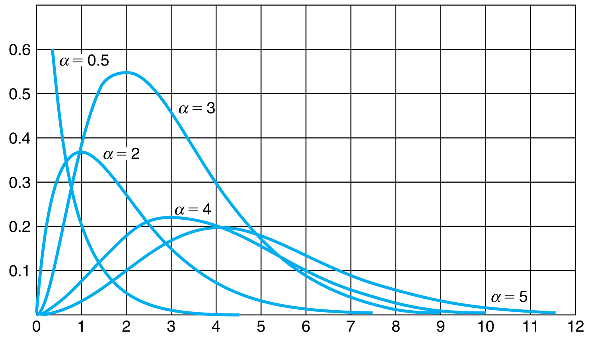
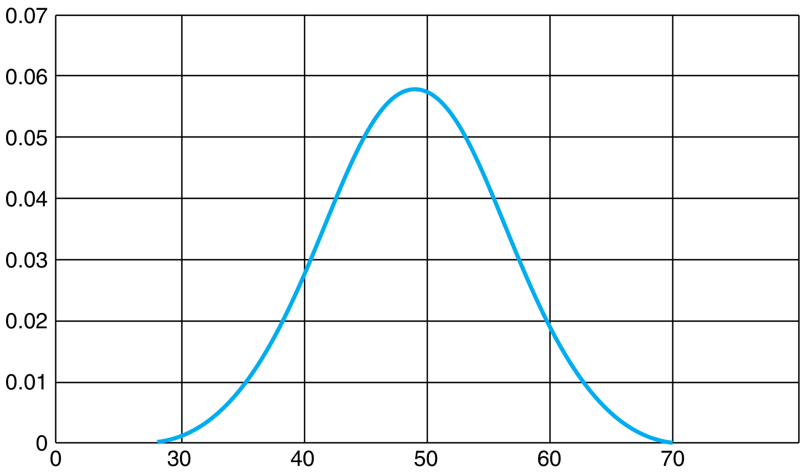

# Gamma Distribution

## Gamma Distribution

A random variable is said to have a Gamma distribution if for parameters $(\alpha, \lambda)$ with $\lambda > 0$ (called the rate) and $\alpha > 0$ (called the shape), it has the following probability distribution

$$
\begin{aligned}
        p_{X}(x) = \begin{cases}
            \frac{\lambda e^{-\lambda x} (\lambda x)^{\alpha - 1}}{\Gamma(\alpha)} &\mbox{if $x \geq 0$}\newline
            0 &\mbox{otherwise}
        \end{cases}
    \end{aligned}
$$

where the denominator is defined as

$$
\begin{aligned}
        \Gamma (\alpha) &= \int_{0}^{\infty} e^{-x} x^{\alpha - 1}\newline
        &= (\alpha - 1) \int_{0}^{\infty} e^{-x} x^{\alpha - 2} dy \quad \text{using integration by parts}\newline
        &= (\alpha - 1) \Gamma (\alpha - 1)
    \end{aligned}
$$

Note that at $\alpha = 1$, $\Gamma (1) = \int_{0}^{\infty} e^{-x} = 1$. Hence, if $\alpha$ is an integer, $\Gamma(\alpha) = (\alpha-1) !$ using the recursion relation derived above.

For a fixed $\lambda$, as the value of $\alpha$ becomes large, the distribution takes the form of a normal distribution.

<figure class="notes-img gamma_1">
  
  <figcaption>Gamma distribution for $\lambda = 1$ and different values of $\alpha$</figcaption>
</figure>
<figure class="notes-img gamma_1">
  
  <figcaption>distribution for $\alpha = 50$</figcaption>
</figure>

There is an alternate formulation of the Gamma distribution where $\beta$ is used instead of $\lambda$, with $\beta = 1/\lambda$ and $\beta$ is called the scale parameter.

### Mean, Variance and Moment Generating Function

Mean and variance are easily obtainable for this using the moment generating function. Recall

$$
\begin{aligned}
        \phi(t) &= E[e^{tX}]\newline
        \phi^{n}(t) &= E[X^{n}]
    \end{aligned}
$$

For the current distribution,

$$
\begin{aligned}
        \phi(t) &= \frac{\lambda^{\alpha}}{\Gamma(\alpha)} \int_{0}^{\infty} e^{tx} e^{-\lambda x} x^{\alpha - 1} dx\newline
        &= \bigg(\frac{\lambda}{\lambda - t}\bigg)^{\alpha}
    \end{aligned}
$$

by rearranging the terms to complete an integral of a Gamma distribution with parameters $(\alpha, \lambda - t)$. Differentiating,

$$
\begin{aligned}
        \phi^{\prime}(t) &= \frac{\alpha \lambda^{\alpha}}{(\lambda - t)^{\alpha + 1}}\newline
        \phi^{\prime \prime}(t) &= \frac{\alpha(\alpha + 1)\lambda^{\alpha}}{(\lambda - t)^{\alpha + 2}}\newline
        E[X] &= \phi^{\prime}(0) = \frac{\alpha}{\lambda}\newline
        Var(X) &= \phi^{\prime \prime}(0) = \frac{\alpha}{\lambda^{2}}
    \end{aligned}
$$

### Sum of Gamma Distributions

Let $X_{1}, X_{2}, \ldots, X_{n}$ be $n$ independent random variables that are gamma distributed with parameters
$(\alpha_{1}, \lambda), (\alpha_{2}, \lambda), \ldots, (\alpha_{n}, \lambda)$. Then the distribution of the sum of these random variables is itself a gamma distribution with the parameters $\alpha^{\prime} = \sum_{i=1}^{n} \alpha_{i}$ and $\lambda^{\prime} = \lambda$.

This follows from the moment generating function of the sum of variables

$$
\begin{aligned}
        E[e^{t(X_{1} + \cdots + X_{n})}] &= \prod_{i=1}^{n} E[e^{tX_{i}}] \; \text{by independence}\newline
        &= \prod_{i=1}^{n} \bigg(\frac{\lambda}{\lambda - t}\bigg)^{\alpha} = \bigg(\frac{\lambda}{\lambda - t}\bigg)^{\sum_{i=1}^{n} \alpha_{i}}
    \end{aligned}
$$

which is the moment generating function of $Gamma(\sum_{i=1}^{n} \alpha_{i}, \lambda)$.

### Relation with Exponential Distribution

With $\alpha = 1$, the Gamma distribution becomes an Exponential distribution with parameter $\lambda$. Based on the previous theorem, the sum of $n$ independent Gamma distributed random variables with parameters $(1, \lambda)$ or equivalently, $n$ independent Exponentially distributed random variables with parameter $\lambda$ is a Gamma distribution with parameters $(n, \lambda)$.
