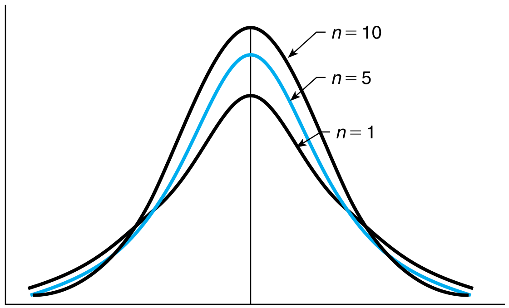
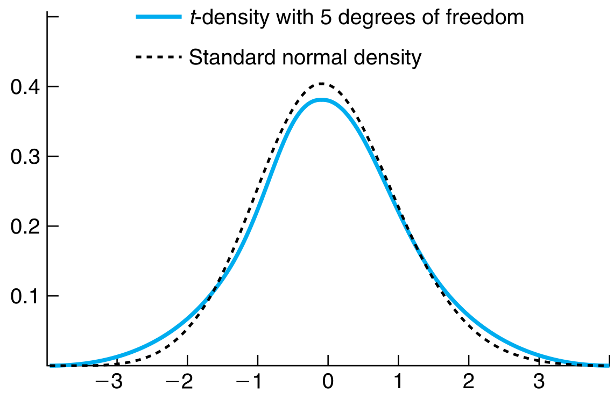
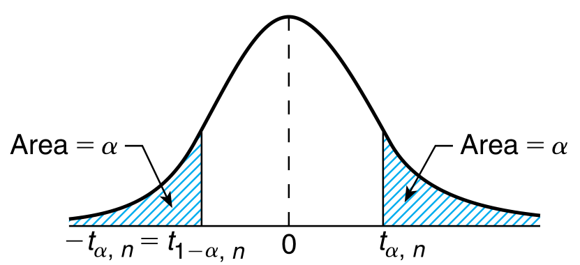

# t-Distribution

## t-Distribution

Let $Z$ be a standard normal random variable and let $\chi_{n}^{2}$ be a chi-square random variable. Assuming these two random variables are independent, the random variable $T_{n}$ is

$$
\begin{aligned}
        T_{n} = \frac{Z}{\sqrt{\chi_{n}^{2}/n}}
    \end{aligned}
$$

is said to have a t-distribution with $n$ degrees of freedom.

This distribution is symmetric around the normal, and as $n$ increases, the distribution becomes more and more like the standard normal distribution.

<figure class="notes-img t_1">
  
  <figcaption>t-distribution for different degrees of freedom</figcaption>
</figure>
<figure class="notes-img t_1">
  
  <figcaption>Comparison with standard normal</figcaption>
</figure>

From the above figure , we see that t-distribution is heavier tailed than a standard normal. Translation, this means that a larger value is more likely to occur under a t-distribution than a standard normal. Furthermore, the heavy tails imply more variance than the standard normal.

For $\alpha$ between $0$ and $1$, let $t_{\alpha, n}$ be such that

$$
\begin{aligned}
        P(T_{n} \geq t_{\alpha, n}) = \alpha
    \end{aligned}
$$

By symmetry around the origin,

$$
\begin{aligned}
        P(T_{n} \leq -t_{\alpha, n}) &= \alpha\newline
        \text{or} \quad P(T_{n} \geq -t_{\alpha, n}) &= 1 - \alpha\newline
        \text{and,} \quad -t_{\alpha, n} &= t_{1 - \alpha, n}
    \end{aligned}
$$

These standard values are available in math charts since they form the basis of the t test.

<figure class="notes-img">
  
  <figcaption>visual representation of $t_{\alpha,n}$</figcaption>
</figure>

### Mean and Variance

The following are stated without proof

$$
\begin{aligned}
        E[T_{n}] &= 0\newline
        Var(T_{n}) &= \frac{n}{n-2}\newline
    \end{aligned}
$$

In the limit of large $n$, the variance is close to $1$, which is consistent with the fact that the distribution resembles a standard normal in that limit.
