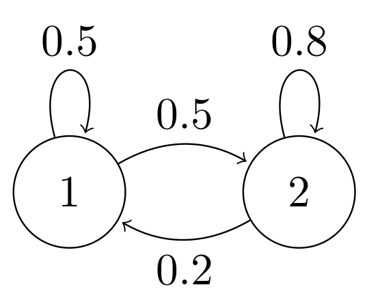
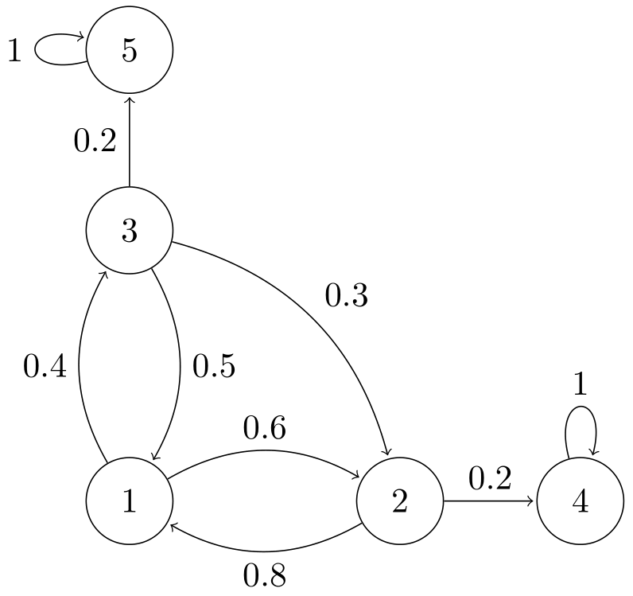
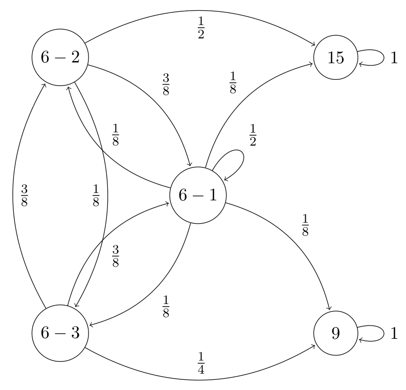

# Exercises Part 3

## Exercises Part 3

1\. **Steady State Markov Process**

Find the steady state probabilites of the following Markov Process [Solution](a_steadymarkov.md)<figure class="notes-img exercises_1">
  
</figure>

2\. **Absorption Probabilities**

Calculate the absorption probabilites for state $4$ and expected time to absortion from all states. (for absorption time, assume $p_{35} = 0$ and $p_{32} = 0.5$) [Solution](a_absorbmarkov.md)
<figure class="notes-img exercises_2">
  
</figure>

3\. **Selecting Courses with Markov Process**
<figure class="notes-img exercises_3">
  
</figure>

Consider the above markov process for changing courses. The probability being in some course tomorrow given a course today is mentioned along the edges. Suppose we start with course 6-1 (Note that course 6 is the combination of courses 6-1, 6-2 and 6-3). Calculate the following

1.  $P($eventually leaving course 6$)$.

2.  $P($eventually landing in course 15$)$.

3.  $E[$number of days till leaving course 6$]$.

4.  At every switch for 6-2 to 6-1 or 6-3 to 6-1, we buy an ice cream (but a maximum of two). Calculate the $E[$number of ice creams before leaving course 6$]$.

5.  Suppose we end up in 15. What is the $E[$number of steps to reach 15$]$.

6.  Suppose we don't want to take course 15. Accordingly, when in 6-1, we stay there with probability $1/2$ while other three options have equal probabilities. If we are in 6-2, probability of going to 6-1 and 6-3 are in the same ratio as before. Calculate the $E[$number of days until we enter course 9$]$.

7.  Assuming

$$
\begin{aligned}
        P(X_{n+1}=15 \vert X_{n}=9) &= P(X_{n+1}=9 \vert X_{n}=15) = P(X_{n+1}=15 \vert X_{n}=15)\newline
        &= P(X_{n+1}=9 \vert X_{n}=9) = 1/2
    \end{aligned}
$$

    what is $P(X_{n}=15)$ and $P(X_{n}=9)$ far into the future.

8.  Suppose

$$
\begin{aligned}
        P(X_{n+1}=6-1 \vert X_{n}=9) &= 1/8 \newline
        P(X_{n+1}=9 \vert X_{n}=9) &= P(X_{n+1}=15 \vert X_{n}=15) = 7/8
    \end{aligned}
$$

    what is the $E[$number of days till return to 6-1$]$.

[Solution](a_markovcourse.md)
