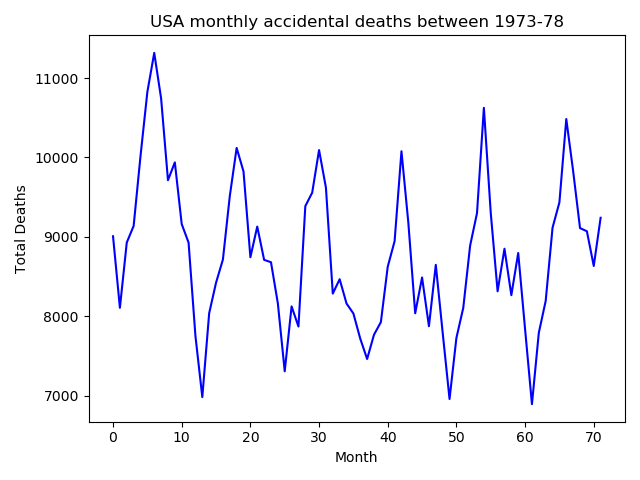
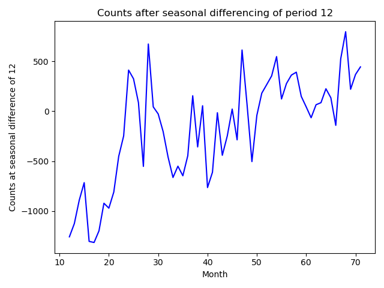
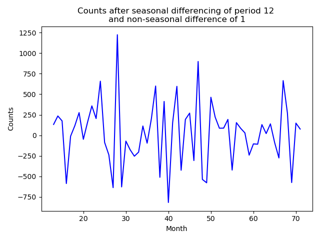
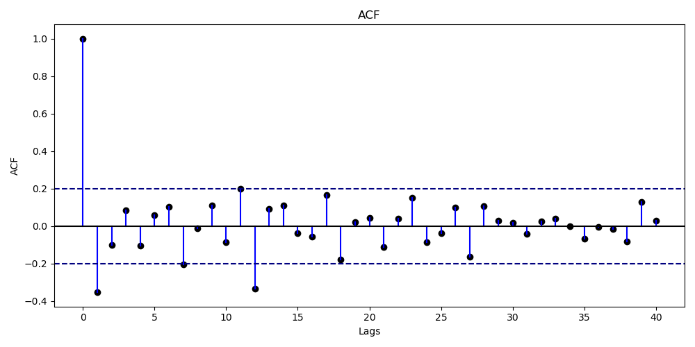
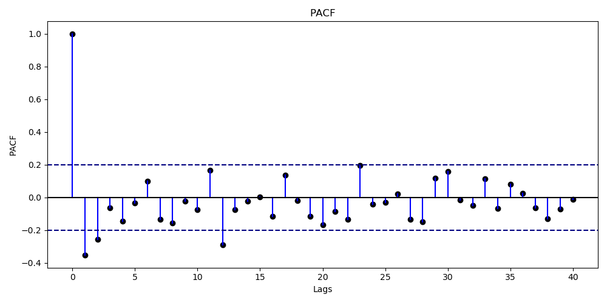
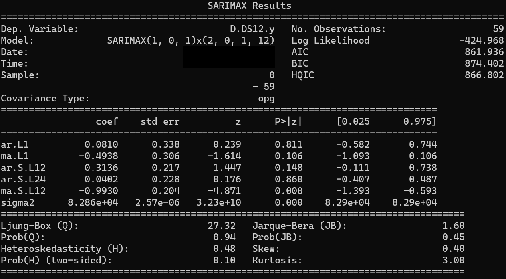
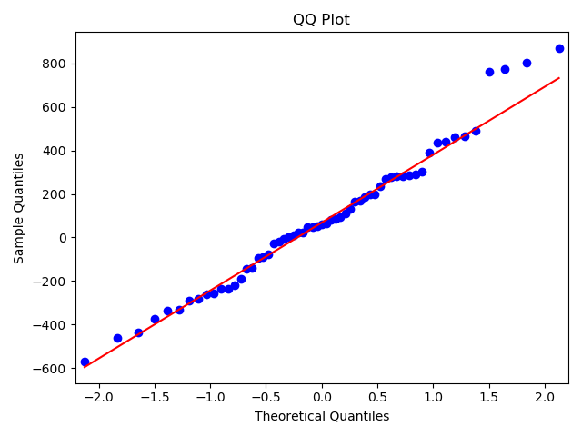
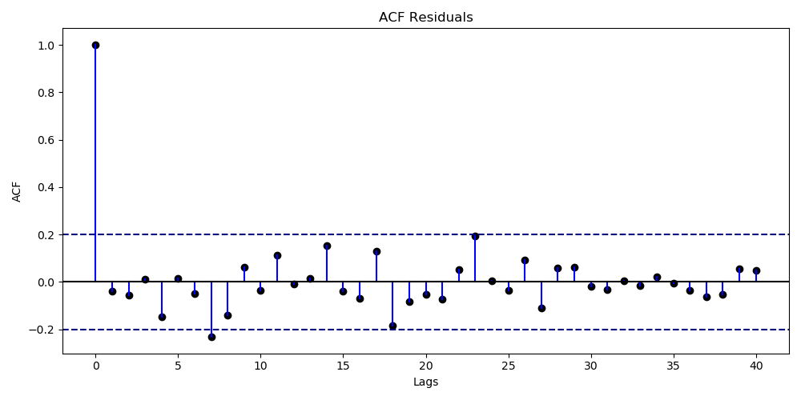
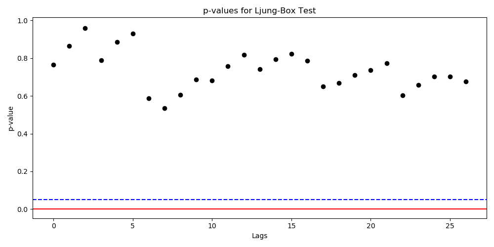

# Walkthrough Example

In this section, we look at fitting a SARIMA model on the USAccDeaths data set which contains the number of total accidental deaths in USA at a monthly levels. The data set has two columns, the year-month column and the deaths total. Complete code is avaialable in file [time_series_python.py](../../codes/time_series_python.md)

-   We begin by plotting the data.
<figure class="notes-img">
  
  <figcaption>Original time series.</figcaption>
</figure>

-   We notice that there is a seasonality component involved. Also, the mean of the series is not 0. Let's start by doing a seasonal difference first.
<figure class="notes-img">
  
  <figcaption>Series with seasonal differencing (period 12)</figcaption>
</figure>

-   There is still some trend. A simple $1^{st}$ order difference should remove this trend.
<figure class="notes-img">
  
  <figcaption>Time series after non-seasonal difference of 1</figcaption>
</figure>

-   This is an almost stationary series. We continue the analysis by preparing the ACF and PACF.
<figure class="notes-img">
  
  <figcaption>ACF Plot</figcaption>
</figure>
<figure class="notes-img">
  
  <figcaption>PACF Plot</figcaption>
</figure>

-   From the ACF plot, there are only two peaks that are separated by a lag of 12. Hence, the non-seasonal MA is $\leq 1$ and seasonal MA $\leq 1$.

-   From the PACF plot, there are two nearby peaks at lag 1 and 2, and there is one more peak at lag 12. Hence, the non-seasonal AR is $\leq 2$ and seasonal AR $\leq 1$.

-   We chose the model $(p,d,q,P,D,Q) = (0,1,1,0,1,1)$ after checking the AIC for various combinations and following the rule of thumb that $p+d+q+P+D+Q \leq 6$..
<figure class="notes-img">
  
  <figcaption>SARIMAX(0,1,1,0,1,1)12 model summary</figcaption>
</figure>

-   Our model equation becomes

$$
\begin{aligned}
            (1-B)(1-B^{12})X_{t} &= (1 - 0.4303B)(1 - 0.5527B^{12})Z_{t}\newline
            Z_{t} &\sim \mathcal{N}(0, 99350)
        \end{aligned}
$$

    and model summary is shown in previous figure.

-   We check the QQ plot to confirm that the residuals are indeed normally distributed. We also check for any correlations between the residuals.
<figure class="notes-img">
  
  <figcaption>QQ Plot</figcaption>
</figure>
<figure class="notes-img">
  
  <figcaption>ACF of residuals</figcaption>
</figure>

-   Barring the noise, no such significant correlations exist. Ljung Box text on the residuals further confirms this. (High $p-values$ imply that we can accept the null hypothesis which is that the data points are independent)
<figure class="notes-img">
  
  <figcaption>Ljung-Box test, Dotted blue line is 0.05 significance level</figcaption>
</figure>
