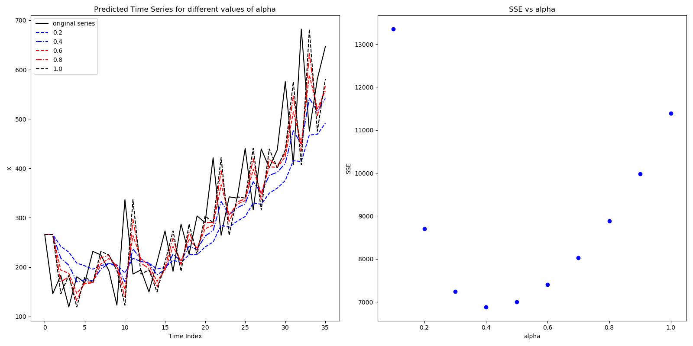

# Simple Exponential Smoothing

The idea here is to use a weighted average of all of the last known values. A natural choice is to use a sequence of decaying weights and a geometric fits well in this case. We normalize the weights so that they sum upto 1.

$$
\begin{aligned}
    \sum_{i=0}^{\infty} (1-\alpha)^{k} &= \frac{1}{\alpha}\newline
    \sum_{i=0}^{\infty} \alpha(1-\alpha)^{k} &= 1\end{aligned}
$$

Using these weights, the forecast becomes

$$
\begin{aligned}
    x_{n+1|n} &= \alpha x_{n} + \alpha(1-\alpha)x_{n-1} + \alpha(1-\alpha)^{2}x_{n-2} + \cdots + \alpha(1-\alpha)^{k} + \cdots\end{aligned}
$$

To avoid using infinite terms, we create a recurrent relation

$$
\begin{aligned}
    x_{n+1|n} &= \alpha x_{n} + \alpha(1-\alpha)x_{n-1} + \alpha(1-\alpha)^{2}x_{n-2} + \cdots\newline
    &= \alpha x_{n} + (1-\alpha)(\alpha x_{n-1} + \alpha(1-\alpha)x_{n-2} + \alpha(1-\alpha)^{2}x_{n-3} + \cdots)\newline
    x_{n+1|n} &= \alpha x_{n} + (1-\alpha)x_{n|n-1}\end{aligned}
$$

But note that Simple Exponential Smoothing is a flat forecaster

$$
\begin{aligned}
    x_{t+h|t} = x_{t+1|t} = \alpha x_{n} + (1-\alpha)x_{n|n-1}\end{aligned}
$$

This is because we are not considering any trend or seasonal components in our forecasts. Hence, the level is expected to remain constant. $x$ is often referred to as level $l$. This distinction will be useful when we work with trend and seasonality.

In practice, we use this recurrence as

$$
\begin{aligned}
    x_{2|1} &= x_{1}\newline
    x_{3|2} &= \alpha x_{2} + (1-\alpha)x_{2|1}\newline
    x_{4|3} &= \alpha x_{3} + (1-\alpha)x_{3|2}\newline
    &\vdots\newline
    x_{n+1|n} &= \alpha x_{n} + (1-\alpha)x_{n|n-1}\end{aligned}
$$

$\alpha$ close to 1 will give higher weight to nearer observations and vice versa. To chose the optimal value of $\alpha$, we will calculate the SSE for various combinations of $\alpha \in [0,1]$ and choose the one with lowest SSE.

$$
\begin{aligned}
    SSE = \sum_{i=1}^{n}(x_{i} - x_{i|i-1})^{2}\end{aligned}
$$

Figure below shows an example of how different $\alpha$ affect the forecasted time series, and the changes in SSE with $\alpha$.

<figure class="notes-img">
  
  <figcaption>Forecasted series as function of $\alpha$ on left, and SSE as a function of $\alpha$ on right for Simple Exponential Smoothing. Figures plot using <a href="../../codes/ses.md">ses.py</a></figcaption>
</figure>
